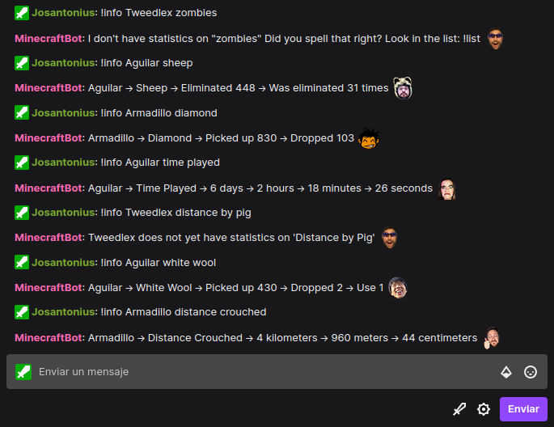

# PHP Minecraft Server Player Stat library

[](https://packagist.org/packages/josantonius/minecraft-server-player-stat)
[](LICENSE)
[](https://packagist.org/packages/josantonius/minecraft-server-player-stat)
[](https://github.com/josantonius/php-minecraft-server-player-stat/actions/workflows/ci.yml)
[](https://codecov.io/gh/josantonius/php-minecraft-server-player-stat)
[](https://www.php-fig.org/psr/psr-1/)
[](https://www.php-fig.org/psr/psr-4/)
[](https://www.php-fig.org/psr/psr-12/)

**Translations**: [Español](.github/lang/es-ES/README.md)

PHP library to get live statistics about players on Minecraft servers.

---

- [Requirements](#requirements)
- [Relevant details](#relevant-details)
- [Installation](#installation)
- [Available Classes](#available-classes)
  - [MinecraftServer Class](#minecraftserver-class)
  - [MinecraftPlayerStat Instance](#minecraftplayerstat-instance)
- [Exceptions Used](#exceptions-used)
- [Usage](#usage)
- [Tests](#tests)
- [TODO](#todo)
- [Changelog](#changelog)
- [Contribution](#contribution)
- [Sponsor](#sponsor)
- [License](#license)

---

## Requirements

- This library is compatible with the PHP versions: 8.1.

- Minecraft Server: [Spigot](https://www.spigotmc.org/).

- Minecraft Versión: 1.17.

- Operating System: Linux | Windows.

## Relevant details

- This library was developed for an application running from the PHP command line (CLI), specifically
to power a Twitch bot that displayed live player statistics. I do not recommend using it for a web
environment, although it will work.

  

- It probably works for recent versions of the Spigot server, but I can't say for sure as it has only
been tested with the requirements detailed above. Feel free to add new tests for other servers or
Minecraft versions.

- The available terms are set from the
[minecraft-assets repository](https://github.com/InventivetalentDev/minecraft-assets/branches/all)
of [InventivetalentDev](https://github.com/InventivetalentDev).

## Installation

The preferred way to install this extension is through [Composer](http://getcomposer.org/download/).

To install **PHP Minecraft Server Player Stat library**, simply:

```console
composer require josantonius/minecraft-server-player-stat
```

The previous command will only install the necessary files,
if you prefer to **download the entire source code** you can use:

```console
composer require josantonius/minecraft-server-player-stat --prefer-source
```

You can also **clone the complete repository** with Git:

```console
git clone https://github.com/josantonius/php-minecraft-server-player-stat.git
```

## Available Classes

### MinecraftServer Class

`Josantonius\MinecraftServerPlayerStat\MinecraftServer`

Create a new instance for the Minecraft server:

```php
/**
 * @param string $version     Server version.
 * @param string $language    Server language.
 * @param string $logsPath    Server logs directory path.
 * @param string $statsPath   Server stats directory path.
 * @param string $storagePath Directory path where available terms and players will be stored.
 *
 * @throws MinecraftServerException      if the Minecraft version or language is not valid.
 * @throws UnreadableDirectoryException  if the logs or stats path is not valid.
 * @throws UnwriteableDirectoryException if the storage path is not valid.
 *
 * @see https://mcasset.cloud/1.19.2/assets/minecraft/lang to see available languages.
 */
public function __construct(
    private string $version,
    private string $language,
    private string $logsPath,
    private string $statsPath,
    private string $storagePath,
);
```

Gets details about certain player statistics:

```php
/**
 * @param string $username Username in case insensitive.
 * @param string $term     Literal Minecraft term in case insensitive.
 *                         In Spanish, a term with accents can be written without them. 
 *                         For another languages accents are required.
 *
 * @throws WrongTermException       if the term is not valid.
 * @throws StatsNotFoundException   if the stats file is not found.
 * @throws UnknownUsernameException if the username is not valid.
 */
public function getPlayerStat(string $username, string $term): MinecraftPlayerStat;
```

Get list of available statistics:

```php
public function getAvailableStats(): array;
```

Get list of players from the server:

```php
public function getPlayerList(): array;
```

### MinecraftPlayerStat Instance

`Josantonius\MinecraftServerPlayerStat\MinecraftPlayerStat`

Number of broken items or null if there are no statistics:

```php
public readonly int|null $broken;
```

Number of crafted items or null if there are no statistics:

```php
public readonly int|null $crafted;
```

Number of dropped items or null if there are no statistics:

```php
public readonly int|null $dropped;
```

Number of killed mobs or null if there are no statistics:

```php
public readonly int|null $killed;
```

Number of killed by mobs or null if there are no statistics:

```php
public readonly int|null $killedBy;
```

Number of mined items or null if there are no statistics:

```php
public readonly int|null $mined;
```

Number of picked up items or null if there are no statistics:

```php
public readonly int|null $pickedUp;
```

Number of used items or null if there are no statistics:

```php
public readonly int|null $used;
```

Custom statistics value or null if there are no statistics:

```php
/**
 * If the unit type is distance, this value is given in centimeters.
 * If the unit type is time, this value is given in ticks.
 * 
 * @see https://minecraft.fandom.com/wiki/Tutorials/Units_of_measure to see the unit conversions.
 */
public readonly int|null $custom;
```

Sanitized key for the term:

```php
public readonly string $key;
```

Term expressed in a nice way:

```php
public readonly string $prettyTerm;
```

Query term:

```php
public readonly string $term;
```

Item type:

```php
/**
 * Available types: block, entity, item, stat.
 */
public readonly string $type;
```

Unit type:

```php
/**
 * Available types: amount, distance, time.
 */
public readonly string $unitType;
```

Username for which the query is being made:

```php
public readonly string $username;
```

User UUID for which the query is being made:

```php
public readonly string $uuid;
```

## Exceptions Used

Example of use for this library:

```php
use Josantonius\MinecraftServerPlayerStat\Exceptions\WrongTermException;
use Josantonius\MinecraftServerPlayerStat\Exceptions\StatsNotFoundException;
use Josantonius\MinecraftServerPlayerStat\Exceptions\UnknownUsernameException;
use Josantonius\MinecraftServerPlayerStat\Exceptions\MinecraftServerException;
use Josantonius\MinecraftServerPlayerStat\Exceptions\UnreadableDirectoryException;
use Josantonius\MinecraftServerPlayerStat\Exceptions\UnwriteableDirectoryException;
```

## Usage

### Gets player statistics about blocks

```php
use Josantonius\MinecraftServerPlayerStat\MinecraftServer;

$minecraftServer = new MinecraftServer(
    version:     '1.17.1',
    language:    'it_it',
    logsPath:    '/minecraft/logs',
    statsPath:   '/minecraft/saves/world/stats',
    storagePath: '/data/storage',
);

$stat = $minecraftServer->getPlayerStat('Aguilar11235813', 'Blocco Di Diamante');

echo "{$stat->username} ha raccolto {$stat->pickedUp} blocchi di diamante.";

// Aguilar11235813 ha raccolto 8 blocchi di diamanti.
```

**`MinecraftPlayerStat $stat`**

```php
object(Josantonius\MinecraftServerPlayerStat\MinecraftPlayerStat) {
   'broken'     => NULL,
   'crafted'    => NULL,
   'custom'     => NULL,
   'dropped'    => NULL,
   'killed'     => NULL,
   'killedBy'   => NULL,
   'mined'      => 8,
   'pickedUp'   => 8,
   'used'       => NULL,
   'key'        => 'diamond_block',
   'prettyTerm' => 'Blocco di diamante',
   'term'       => 'Blocco Di Diamante',
   'type'       => 'block',
   'unitType'   => 'amount',
   'username'   => 'Aguilar11235813',
   'uuid'       => '18f154fe-3678-37e9-9b77-185e0bfe446d',
}
```

### Gets player statistics about distance

```php
use Josantonius\MinecraftServerPlayerStat\MinecraftServer;

$minecraftServer = new MinecraftServer(
    version:     '1.19.1',
    language:    'es_es',
    logsPath:    '/minecraft/logs',
    statsPath:   '/minecraft/saves/world/stats',
    storagePath: '/data/storage',
);

$stat = $minecraftServer->getPlayerStat('Armadillo', 'Distancia Volada');

echo "{$stat->username} voló una distancia de " . cmToKm($stat->custom) . ' kilómetros.';

// Armadillo voló una distancia de 6 kilómetros.
```

**`MinecraftPlayerStat $stat`**

```php
object(Josantonius\MinecraftServerPlayerStat\MinecraftPlayerStat) {
   'broken'     => NULL,
   'crafted'    => NULL,
   'custom'     => 585888, // centimeters
   'dropped'    => NULL,
   'killed'     => NULL,
   'killedBy'   => NULL,
   'mined'      => NULL,
   'pickedUp'   => NULL,
   'used'       => NULL,
   'key'        => 'fly_one_cm',
   'prettyTerm' => 'Distancia volada',
   'term'       => 'Distancia Volada',
   'type'       => 'stat',
   'unitType'   => 'distance',
   'username'   => 'Armadillo',
   'uuid'       => '14e55460-c753-31f2-bd0a-c305e2ff34b5',
}
```

### Gets player statistics about entities

```php
use Josantonius\MinecraftServerPlayerStat\MinecraftServer;

$minecraftServer = new MinecraftServer(
    version:     '1.17',
    language:    'en_us',
    logsPath:    '/minecraft/logs',
    statsPath:   '/minecraft/saves/world/stats',
    storagePath: '/data/storage',
);

$stat = $minecraftServer->getPlayerStat('KrakenBite', 'zombie');

echo "{$stat->username} was killed {$stat->killedBy} times by a {$stat->term}.";

// KrakenBite was killed 2 times by a zombie.
```

**`MinecraftPlayerStat $stat`**

```php
object(Josantonius\MinecraftServerPlayerStat\MinecraftPlayerStat) {
   'broken'     => NULL,
   'crafted'    => NULL,
   'custom'     => NULL,
   'dropped'    => NULL,
   'killed'     => 8,
   'killedBy'   => 2,
   'mined'      => NULL,
   'pickedUp'   => NULL,
   'used'       => NULL,
   'key'        => 'zombie',
   'prettyTerm' => 'Zombie',
   'term'       => 'zombie',
   'type'       => 'entity',
   'unitType'   => 'amount',
   'username'   => 'KrakenBite',
   'uuid'       => '5cd5d2e7-9b3a-3f06-befb-34f7a81b14c6',
}
```

### Gets player statistics about items

```php
use Josantonius\MinecraftServerPlayerStat\MinecraftServer;

$minecraftServer = new MinecraftServer(
    version:     '1.18.1',
    language:    'fr_fr',
    logsPath:    '/minecraft/logs',
    statsPath:   '/minecraft/saves/world/stats',
    storagePath: '/data/storage',
);

$stat = $minecraftServer->getPlayerStat('Tweedlex', 'HACHE ON BOIS');

echo "{$stat->username} a utilisé une " . strtolower($stat->term) . " {$stat->used} fois.";

// Tweedlex a utilisé une hache en bois 111 fois.
```

**`MinecraftPlayerStat $stat`**

```php
object(Josantonius\MinecraftServerPlayerStat\MinecraftPlayerStat) {
   'broken'     => 8,
   'crafted'    => 8,
   'custom'     => NULL,
   'dropped'    => NULL,
   'killed'     => NULL,
   'killedBy'   => NULL,
   'mined'      => NULL,
   'pickedUp'   => NULL,
   'used'       => 111,
   'key'        => 'wooden_axe',
   'prettyTerm' => 'Hache en bois',
   'term'       => 'HACHE ON BOIS',
   'type'       => 'item',
   'unitType'   => 'amount',
   'username'   => 'Tweedlex',
   'uuid'       => '8cb86072-3472-3b86-90f2-1e11b7188197',
}
```

### Gets player statistics about time

```php
use Josantonius\MinecraftServerPlayerStat\MinecraftServer;

$minecraftServer = new MinecraftServer(
    version:     '1.19.2',
    language:    'pt_br',
    logsPath:    '/minecraft/logs',
    statsPath:   '/minecraft/saves/world/stats',
    storagePath: '/data/storage',
);

$stat = $minecraftServer->getPlayerStat('SpOok', 'tempo   desde a última morte');

echo 'SpOok morreu pela última vez há ' . ticksToHour($stat->custom) . ' horas.';

// SpOok morreu pela última vez há 10 horas.
```

**`MinecraftPlayerStat $stat`**

```php
object(Josantonius\MinecraftServerPlayerStat\MinecraftPlayerStat) {
   'broken'     => NULL,
   'crafted'    => NULL,
   'custom'     => 720000, // ticks
   'dropped'    => NULL,
   'killed'     => NULL,
   'killedBy'   => NULL,
   'mined'      => NULL,
   'pickedUp'   => NULL,
   'used'       => NULL,
   'key'        => 'time_since_death',
   'prettyTerm' => 'Tempo desde a última morte',
   'term'       => 'tempo   desde a última morte',
   'type'       => 'stat',
   'unitType'   => 'time',
   'username'   => 'SpOok',
   'uuid'       => '8d5b923d-37fb-38d1-8a6a-a17cd5ccf768',
}
```

### Get list of available statistics

```php
use Josantonius\MinecraftServerPlayerStat\MinecraftServer;

$minecraftServer = new MinecraftServer(
    version:     '1.17.1',
    language:    'en_us',
    logsPath:    '/minecraft/logs',
    statsPath:   '/minecraft/saves/world/stats',
    storagePath: '/data/storage',
);

$terms = $minecraftServer->getAvailableStats();
```

**`$terms`**

```php
[
    /* ... */

    'zombie spawn egg' => [
        'key' => 'zombie_spawn_egg',
        'pretty_term' => 'Zombie Spawn Egg',
        'type' => 'item',
        'unit_type' => 'amount',
    ],
    'zombie villager' => [
        'key' => 'zombie_villager',
        'pretty_term' => 'Zombie Villager',
        'type' => 'entity',
        'unit_type' => 'amount',
    ],
    'zombie villager spawn egg' => [
        'key' => 'zombie_villager_spawn_egg',
        'pretty_term' => 'Zombie Villager Spawn Egg',
        'type' => 'item',
        'unit_type' => 'amount',
    ],
    'zombie wall head' => [
        'key' => 'zombie_wall_head',
        'pretty_term' => 'Zombie Wall Head',
        'type' => 'block',
        'unit_type' => 'amount',
    ],
    'zombified piglin' => [
        'key' => 'zombified_piglin',
        'pretty_term' => 'Zombified Piglin',
        'type' => 'entity',
        'unit_type' => 'amount',
    ],
    'zombified piglin spawn egg' => [
        'key' => 'zombified_piglin_spawn_egg',
        'pretty_term' => 'Zombified Piglin Spawn Egg',
        'type' => 'item',
        'unit_type' => 'amount',
    ],
]
```

### Get list of players from the server

```php
use Josantonius\MinecraftServerPlayerStat\MinecraftServer;

$minecraftServer = new MinecraftServer(
    version:     '1.17',
    language:    'en_us',
    logsPath:    '/minecraft/logs',
    statsPath:   '/minecraft/saves/world/stats',
    storagePath: '/data/storage',
);

$players = $minecraftServer->getPlayerList();
```

**`$players`**

```php
[
    /* ... */

  'armadillo'       => '14e55460-c753-31f2-bd0a-c305e2ff34b5',
  'aguilar11235813' => '18f154fe-3678-37e9-9b77-185e0bfe446d',
  'krakenbite'      => '5cd5d2e7-9b3a-3f06-befb-34f7a81b14c6',
  'tweedlex'        => '8cb86072-3472-3b86-90f2-1e11b7188197',
  'spook'           => '8d5b923d-37fb-38d1-8a6a-a17cd5ccf768',
]
```

## Tests

To run [tests](tests) you just need [composer](http://getcomposer.org/download/)
and to execute the following:

```console
git clone https://github.com/josantonius/php-minecraft-server-player-stat.git
```

```console
cd PHP-MimeType
```

```console
composer install
```

Run unit tests with [PHPUnit](https://phpunit.de/):

```console
composer phpunit
```

Run code standard tests with [PHPCS](https://github.com/squizlabs/PHP_CodeSniffer):

```console
composer phpcs
```

Run [PHP Mess Detector](https://phpmd.org/) tests to detect inconsistencies in code style:

```console
composer phpmd
```

Run all previous tests:

```console
composer tests
```

## TODO

- [ ] Add new feature
- [ ] Improve tests
- [ ] Improve documentation
- [ ] Improve English translation in the README file
- [ ] Refactor code for disabled code style rules (see phpmd.xml and phpcs.xml)

## Changelog

Detailed changes for each release are documented in the
[release notes](https://github.com/josantonius/php-minecraft-server-player-stat/releases).

## Contribution

Please make sure to read the [Contributing Guide](.github/CONTRIBUTING.md), before making a pull
request, start a discussion or report a issue.

Thanks to all [contributors](https://github.com/josantonius/php-minecraft-server-player-stat/graphs/contributors)! :heart:

## Sponsor

If this project helps you to reduce your development time,
[you can sponsor me](https://github.com/josantonius#sponsor) to support my open source work :blush:

## License

This repository is licensed under the [MIT License](LICENSE).

Copyright © 2021-2023, [Josantonius](https://github.com/josantonius#contact)
